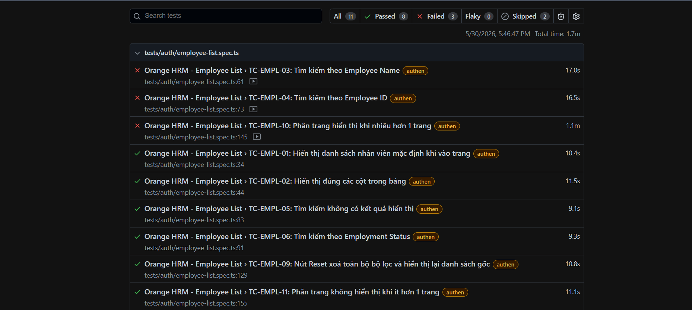

# OrangeHRM Automation Test Project

## About OrangeHRM

[OrangeHRM](https://orangehrm.com/) is a flexible, all in one HR software that helps businesses of all sizes manage their people, streamline HR processes, and drive growth. From employee management to recruitment and onboarding, performance management and leave management, our HRMS platform makes it easier to keep your workforce productive and engaged.

## Project Overview

This project is designed to apply automation testing processes to [open source website](https://opensource-demo.orangehrmlive.com/web/index.php/auth/login) from OrangeHRM. The project aims to help:

- Reduce manual testing effort
- Improve accuracy and stability
- Support regression testing

---

## Technology Used

- **Language:** Typescript
- **Framework:** [Playwright](https://playwright.dev#heading-ids)
- **Build Tool:** npm

---

## Project Structure

```bash
project-root/

├── tests/                 # Test cases
├── pages/                 # Page Object Models
├── data/                  # Test data
├── playwright-reports/    # Report kết quả test
├── package.json           # NodeJS dependencies
└── README.md
```

---

## Environment Requirements

- NodeJS 18+
- Chrome
- Git

---

## Set-up

### Clone project

```bash
git clone https://github.com/congnhanit/OrangeHRM-playwright-test-project.git
cd OrangeHRM-playwright-test-project
```

### Install dependencies

#### NodeJS

```bash
npm install
```

---

## Run test

### Run all test cases (with authentication)

#### 1. Save session before run test

```bash
npx playwright test auth.setup.ts   # Do the log in and save session
```

#### 2. Run all test cases

```bash
npx playwright test tests/auth
```

#### 3. Run specific test file

```bash
npx playwright test tests/auth/example.spec.ts
```

### Run test on UI mode

```bash
npx playwright test --ui   # run test cases on UI mode
```

---

## Report

### View Report

```bash
npx playwright show-report   # view report on website
```

For example:


### Extent Report

The generated report can be found in the following directory:

```bash
playwright-report/
```

---

## Best Practices

- Apply Page Object Model (POM)
- Avoid hardcoded test data
- Keep tests independent
- Capture logs and screenshots on failure
